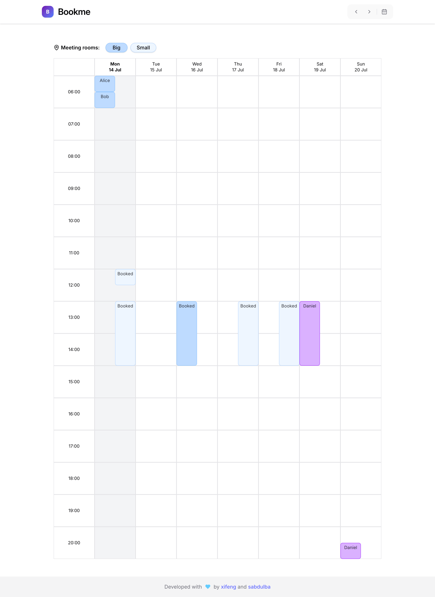

# Book Me - an event calendar (frontend)

This project is a meeting room reservation system built by me and [Abdul](https://github.com/IbnBaqqi), for **Hive Helsinki**.
Abdul initialized the idea and developed an excellent backend using **Spring Boot**, while I focused on building the **frontend**.

- **Live Preview:** [booking-calendar-chi.vercel.app](https://booking-calendar-chi.vercel.app)  
- **GitHub Repo:** [github.com/danielxfeng/booking_calendar](https://github.com/danielxfeng/booking_calendar)
- **Link to Backend:** [https://github.com/IbnBaqqi/book-me](https://github.com/IbnBaqqi/book-me)

---

## Installation

To run this booking calendar application locally, follow these steps:

### Prerequisites
Make sure you have the following installed on your system:
- **Node.js** (version 18 or higher) - [Download here](https://nodejs.org/)

### Step-by-step Installation

1. **Clone the repository**
   ```bash
   git clone https://github.com/danielxfeng/booking_calendar.git
   ```

2. **Navigate to the project directory**
   ```bash
   cd booking_calendar
   ```

3. **Install dependencies**
   ```bash
   npm install
   ```
   This will install all required packages listed in `package.json`

4. **Set up environment variables**
   Create a `.env` file in the root directory with the following content:
   ```bash
    cp .env.sample .env
   ```
   
  > [!NOTE]
  > Replace `http://localhost:8080` with your actual backend API URL. If you're running the backend locally

5. **Start the development server**
   ```bash
   npm run dev
   ```

6. **Open your browser**
   The application should automatically open at `http://localhost:5173` (or another port if 5173 is busy)

---

## Features

- View weekly room bookings in a scrollable calendar view

- Add a new booking with room and time selection

- Delete an existing booking

- **Role-based access control** (RBAC):
  - **Staff** can delete **any** booking
  - **Students** can only delete **their own** bookings

- Built-in conflict prevention for overlapping bookings

- Mobile responsiveness achieved via **horizontal scrolling** — better suited than drag-and-drop for small screens

- Lightweight, **unstyled** prototype focused on functionality

---

## Tech Highlights

- **Three-layer stacked layout**
  - Base grid, booking overlays, and a floating form layer.
  - They are separated to reduce re-renders and decouple UI from logic.

- **TanStack Query** for auto-fetching and intelligent caching
  - Ensures a smooth user experience when switching calendar views, with minimal network requests and loading delays.

- **Axios interceptor** with token expiration handling
  - Gracefully attempts to recover expired tokens without disrupting the user.

- **Custom ScrollSlotPicker**
  - A UI component designed from scratch to offer an intuitive way to select time slots.

- **URL and state sync**
  - Enables deep-linking and state persistence when navigating between dates or sharing calendar views.

- **Jotai** for clean and minimalistic state management
  - Enables consistent state sharing across components.

- **Zod** schema validation integrated with **React Hook Form**
  - Ensures strong typing and robust form validation logic.

- **Vitest** for unit tests
  - Helps maintain code quality.

---

## Known Issues & Future Improvements

- UI is unstyled (Partly solved)
- A better radio btn?
- No logout button
- The "auto-find empty slot" algorithm can be optimized
- Booking form does not allow changing the selected date
- Does not support inter-day bookings (Do we need that?)
- Display more booking info depending on block size
- Add more tests (unit, integration, E2E)

---

## Project Structure

```
src/
├── components/ # All UI components
│ ├── ui/ # Components from ShadCN UI
│ ├── BasicGrids/ # Base time × room grid layout
│ ├── BookingForm/ # A "sheet" component for booking create/update
│ ├── CalendarHeader/ # Week header
│ ├── ErrorBoundary/ # Global error fallback UI
│ ├── Loading/ # Spinner/loading placeholder
│ ├── Main/ # Main calendar layout entry
│ ├── OperationRow/ # Top operation bar
│ ├── ScrollSlotPicker/ # Custom scroll-based time slot picker
│ ├── TanQuery/ # Headless wrappers for fetching + hooks
│
├── lib/ # Logic, utilities, and global state
│ ├── apiFetcher.ts # Fetcher for calendar API
│ ├── atoms.ts # Jotai atoms
│ ├── axiosFetcher.ts # Axios instance with token handling
│ ├── bookingFormUtils.ts # BookingForm helpers
│ ├── errorHandler.ts # Error handling
│ ├── hooks/ # # Custom hooks: useStartController to manage the `start` atom
│ ├── normalizeStartDate.ts # Aligns start date from URL to calendar view
│ ├── schema.ts # Zod schemas for validation
│ ├── tokenStore.ts # Token persistence and sync
│ ├── tools.ts # Helper functions
│ ├── utils.ts # Utility function from ShadCN UI
│ ├── weekBookings.ts # Core data structure + generator
│
├── config.ts # Global configuration
├── App.tsx # Application entry point
```

## License

MIT

## ScreenShot


