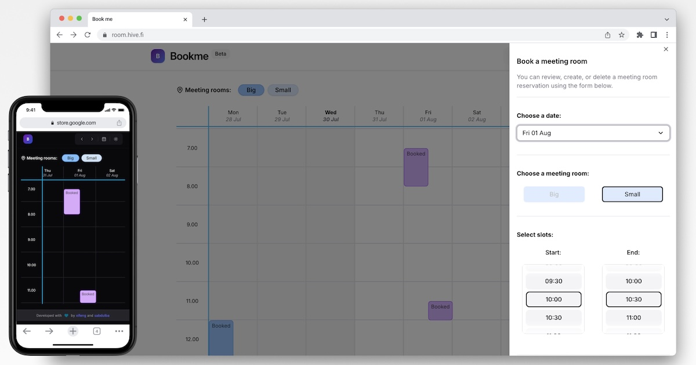

# Book Me - Meeting room booking calendar

A modern, intuitive room booking system built by [Daniel](https://github.com/danielxfeng) and [Abdul](https://github.com/IbnBaqqi) for **Hive Helsinki**.
Big thanks to [Jordane](https://github.com/jgengo), former CTO of Hive Helsinki, for his in-depth code reviews and many valuable suggestions via PRs and Discord.



<br>

## The Story

At Hive Helsinki, students need to request room bookings from staff members, creating a manual workflow that's time-consuming. As students ourselves, we saw an opportunity to apply what we learned in school to solve a real-world problem.

**Book Me** was born from this need - a streamlined room booking system that eliminates the manual overhead while providing a smooth, modern user experience.

- **Live Demo:** [room.jgengo.dev](https://room.jgengo.dev)
- **Frontend Repo:** [github.com/danielxfeng/booking_calendar](https://github.com/danielxfeng/booking_calendar)
- **Backend Repo:** [github.com/IbnBaqqi/book-me](https://github.com/IbnBaqqi/book-me)

<br><br>

## Features

- 📅 **Weekly Calendar View** - Scrollable timeline showing all room bookings
- ✨ **One-Click Booking** - Add new reservations with intuitive time slot selection
- 🗑️ **Smart Deletion** - Role-based access control for booking management
<!-- - 📱 **Mobile-First** - Responsive design optimized for all devices -->
- 🔒 **Conflict Prevention** - Built-in validation prevents double-bookings
- 🎨 **Modern UI** - Clean, accessible interface with smooth animations

### Role-Based Access Control
- **Staff** can manage all bookings across the system
- **Students** can only modify their own reservations

<br>

## Tech Stack

- **Frontend:** React + TypeScript + Vite
- **UI Components:** ShadCN/UI + Tailwind CSS
- **State Management:** Jotai for lightweight, reactive state
- **Data Fetching:** TanStack Query for intelligent caching
- **Form Handling:** React Hook Form + Zod validation
- **HTTP Client:** Axios with automatic token refresh
- **Testing:** Vitest for unit testing

<br>

## Getting Started

### Prerequisites
- **Node.js** (version 18 or higher) - [Download here](https://nodejs.org/) or use [nvm](https://github.com/nvm-sh/nvm)

### Local Development

1. **Clone the repository**
   ```bash
   git clone https://github.com/danielxfeng/booking_calendar.git
   cd booking_calendar
   ```

2. **Install dependencies**
   ```bash
   npm install
   ```

3. **Start the development server**
   ```bash
   npm run dev
   ```

4. **Open your browser**
   Navigate to `http://localhost:5173` to see the application

<br>

## Contributing

We welcome contributions! Here's how you can help:

### Development Setup

1. **Fork the repository**
2. **Create a feature branch**
   ```bash
   git checkout -b feature/your-feature-name
   ```
3. **Make your changes**
4. **Run tests**
   ```bash
   npm test
   ```
5. **Submit a pull request**

### Code Style

- Follow the existing TypeScript patterns
- Use Prettier for code formatting
- Write tests for new features
- Update documentation as needed

### Areas for Contribution

- 🎨 UI/UX improvements
- 🧪 Additional test coverage
- 📱 Mobile experience enhancements
- 🚀 Performance optimizations
- 🐛 Bug fixes


## Known Issues & Roadmap

- [x] Enhanced mobile experience
- [ ] Drag-and-drop booking interface
- [ ] Advanced filtering and search
- [x] Email notifications
- [x] Calendar export functionality
- [ ] Integration with external calendar systems


## License

MIT License - feel free to use this project for your own needs!
